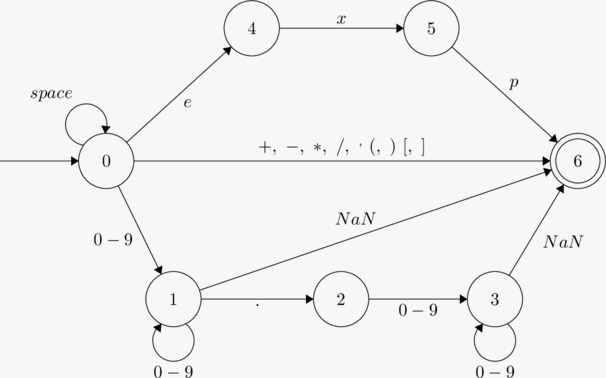
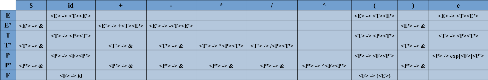

# Instructions for using

## Requirements

Python installed (Built with Python 3.10.2)

## Installing

Download and unzip the .zip file or clone the repository with

```text
git clone https://github.com/henriquedefreitas/math-compiler.git
```

Access the compiler directory and install its library with

```text
python -m pip install -e .
```

Run the program with

```text
python main.py <path_to_input_file>
```

## Parameters

- -t, --show-tree -> Prints the syntax tree
- -e, --show-exp  -> Prints the input expression


# Compiladores I

## Enunciado do Projeto Final

Implemente o Analisador Léxico, Sintático e Semântico da gramática a seguir. Como resultado é esperado que o programa calcule o resultado da expressão passada por parâmetro. Poderá ser utilizado o analisador sintático descendente não recursivo e/ou o ascendente. NÃO será permitido o analisador sintático recursivo. Não será permitido o uso de expressões regulares.

## Gramatica

```text
<E> ➝ <E>+<T> | <E>-<T> | <T>
<T> ➝ <T>*<P> | <T>/<P> | <P>
<P> ➝ <P>^<F> | exp[<F>] | <F>
<F> ➝ (<E>) | id
```

id = número inteiro ou real

## Exemplos

```text
1+2*3^4             //163
(1+2)*3^4           //243
1+(2*3)^4           //1297
1+(2*3)+exp[4]      //61,598150033
```

# Implementacao

Para a implementacao, foi escolhido o analisador sintatico descendente.

## Gramatica resultante apos a remocao da recursao a esquerda

```text
<E>  -> <T><E'>
<E'> -> +<T><E'>
<E'> -> -<T><E'>
<E'> -> &
<T>  -> <P><T'>
<T'> -> *<P><T'>
<T'> -> /<P><T'>
<T'> -> &
<P>  -> <F><P'>
<P>  -> exp[<F>]<P'>
<P'> -> ^<F><P'>
<P'> -> &
<F>  -> (<E>)
<F>  -> id
```

## First e Follow

```text
First(E) = id, (, e
First(E') = &, +, -
First(T) = id, (, e
First(T') = &, *, /
First(P) = id, (, e
First(P') = &, ^
First(F) = id, (

Follow(E) = $, )
Follow(E') = $, )
Follow(T) = $, +, -, )
Follow(T') = $, +, -, )
Follow(P) = $, +, -, *, /, )
Follow(P') = $, +, -, *, /, )
Follow(F) = $, +, -, *, /, ^, ), ]
```

## Automato do analisador lexico



## Tabela do analisador sintatico



## Definicao dirigida a sintaxe

```text
<E>  -> <T> {E'.inh = T.val} <E'> {T.val = E'.syn}
<E'> -> +<T> {E'.inh = E'.inh + T.val} <E'> {E'.syn = E'.syn}
<E'> -> -<T> {E'.inh = E'.inh - T.val} <E'> {E'.syn = E'.syn}
<E'> -> & {E'.syn = E'.inh}
<T>  -> <P> {T'.inh = P.val} <T'> {T.val = T'.syn}
<T'> -> *<P> {T'.inh = T'.inh * P.val} <T'> {T'.syn = T'.syn}
<T'> -> /<P> {T'.inh = T'.inh / P.val} <T'> {T'.syn = T'.syn}
<T'> -> & {T'.syn = T'.inh}
<P>  -> <F> {P'.inh = F.val} <P'> {P.val = P'.syn}
<P>  -> exp[<F> {P'.inh = F.val}]<P'> {P.syn = P'.syn}
<P'> -> ^<F> {P'.inh = P'.inh / F.val} <P'> {P'.syn = P'.syn}
<P'> -> & {P'.syn = P'.inh}
<F>  -> (<E> {F.val = E.val} )
<F>  -> id {F.val = id.lexval}
```
